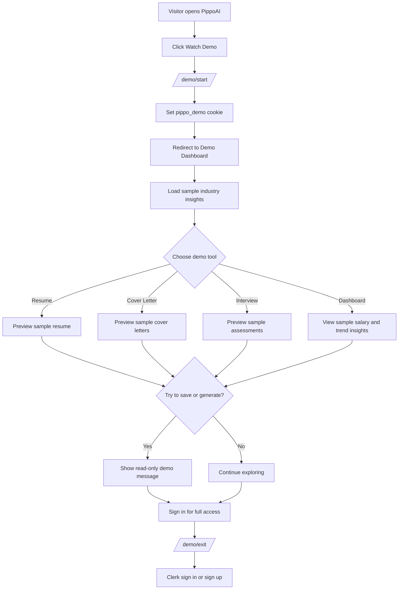
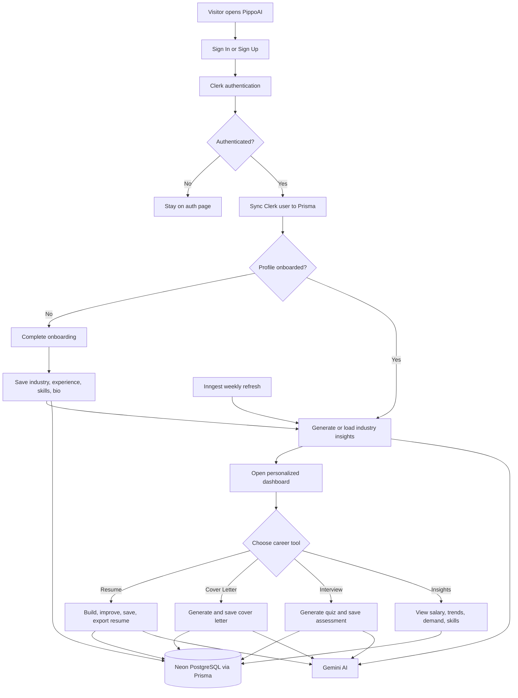
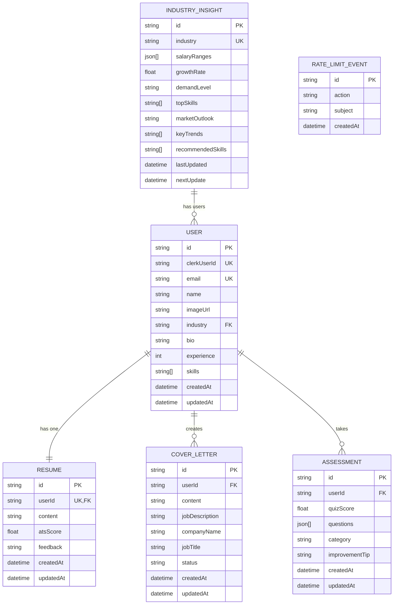
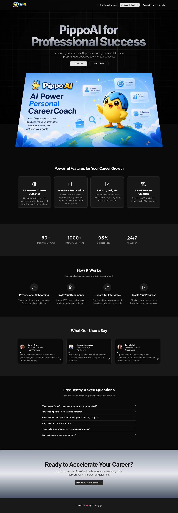
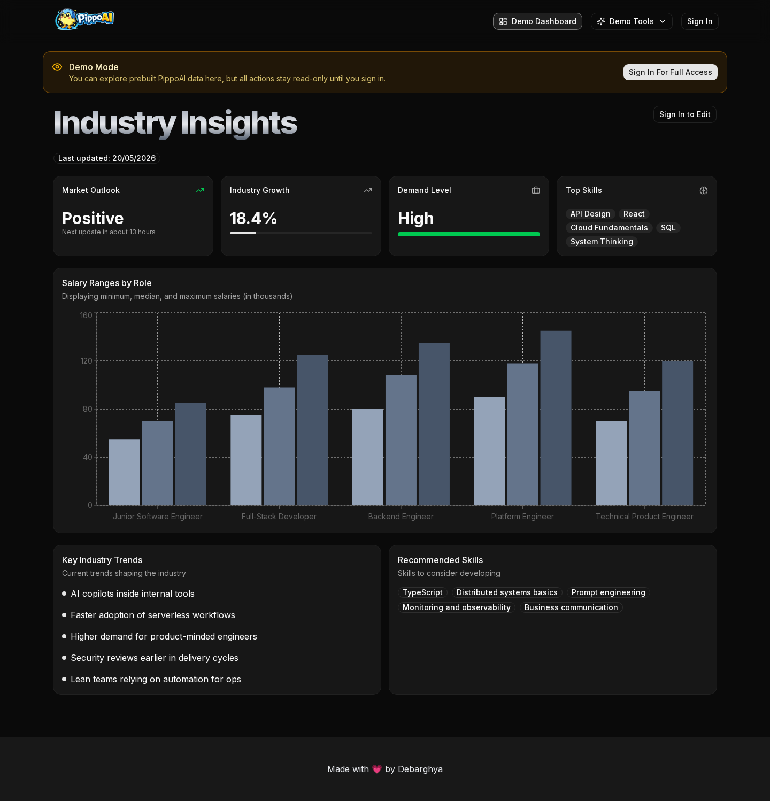
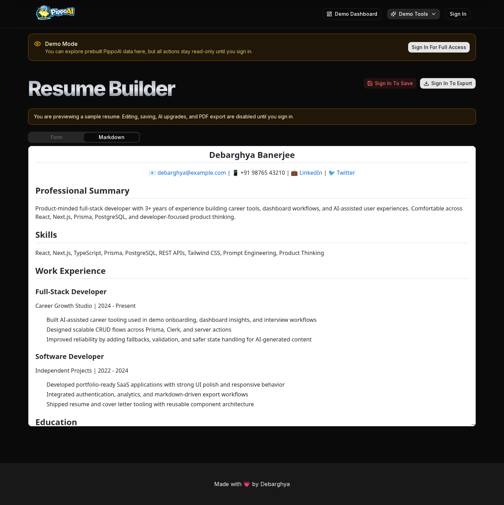
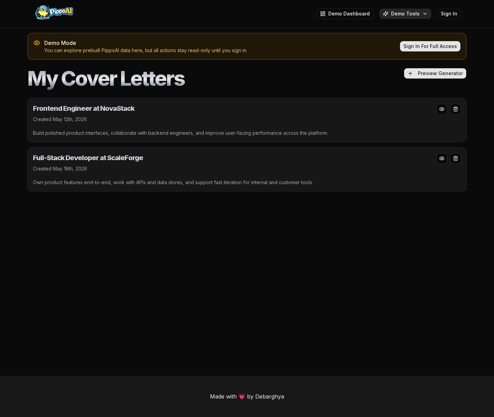
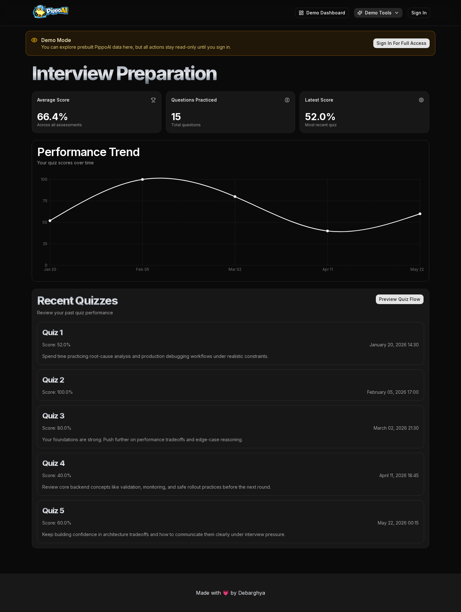

# 🤖 PippoAI : AI-powered career coach

PippoAI helps users build resumes, generate cover letters, practice interviews, and explore personalized career insights with AI.

## 🌐 Live Demo

Please check **Watch Demo** first to explore PippoAI in read-only demo mode before signing in.

<p>
  <a href="https://pippoai.debarghya.org/demo/start"></a> 👈 Click Here
</p>

 Live link  : https://pippoai.debarghya.org

## 💡 Motivation

Job preparation can feel scattered across resume tools, cover letter templates, interview practice sites, and career research. PippoAI brings these workflows into one focused platform so users can prepare smarter and move with more confidence.

## ✨ Features

- 📄 AI-powered resume builder with markdown editing and PDF export
- 📝 Personalized cover letter generation for specific roles and companies
- 🎯 Mock interview quizzes with score tracking and improvement tips
- 📊 Industry insights with salary ranges, trends, demand level, and recommended skills
- 👀 Read-only demo mode for exploring the app before signing in
- 🔐 Secure authentication and user-specific saved career data

## 🏗️ Architecture

### 1. 3-Tier Client-Server Architecture

#### 👀 Demo Login Architecture

```text
┌─────────────────────────────────────────────────────────────────────┐
│ Tier 1: Client / Presentation Layer                                 │
│                                                                     │
│ Browser UI                                                          │
│ ├─ Landing Page                                                     │
│ ├─ Watch Demo Button                                                │
│ ├─ Demo Dashboard                                                   │
│ ├─ Demo Resume Preview                                              │
│ ├─ Demo Cover Letter Preview                                        │
│ └─ Demo Interview Preview                                           │
└───────────────────────────────┬─────────────────────────────────────┘
                                │
                                ▼
┌─────────────────────────────────────────────────────────────────────┐
│ Tier 2: Application / Business Logic Layer                          │
│                                                                     │
│ Next.js App Router + Server Actions + Middleware                    │
│ ├─ /demo/start sets demo cookie                                     │
│ ├─ Middleware allows protected pages for demo visitors               │
│ ├─ Demo helpers return sample profile, resume, letters, assessments │
│ ├─ Write actions are blocked in demo mode                           │
│ └─ Sign-in CTA exits demo for full access                           │
└───────────────────────────────┬─────────────────────────────────────┘
                                │
                                ▼
┌─────────────────────────────────────────────────────────────────────┐
│ Tier 3: Data / External Services Layer                              │
│                                                                     │
│ Demo Data + Optional External Auth                                  │
│ ├─ Static sample profile and career data                            │
│ ├─ Static sample resume                                             │
│ ├─ Static sample cover letters                                      │
│ ├─ Static sample interview assessments                              │
│ └─ Clerk only when user chooses to sign in                          │
└─────────────────────────────────────────────────────────────────────┘
```

#### 🔐 Authenticated User Architecture

```text
┌─────────────────────────────────────────────────────────────────────┐
│ Tier 1: Client / Presentation Layer                                 │
│                                                                     │
│ Browser UI                                                          │
│ ├─ Clerk Sign In / Sign Up                                          │
│ ├─ Onboarding Form                                                  │
│ ├─ Personalized Dashboard                                           │
│ ├─ Resume Builder                                                   │
│ ├─ Cover Letter Generator                                           │
│ └─ Interview Prep                                                   │
└───────────────────────────────┬─────────────────────────────────────┘
                                │
                                ▼
┌─────────────────────────────────────────────────────────────────────┐
│ Tier 2: Application / Business Logic Layer                          │
│                                                                     │
│ Next.js App Router + Server Actions + Middleware                    │
│ ├─ Clerk middleware protects private routes                         │
│ ├─ User sync stores Clerk profile in Prisma                         │
│ ├─ Onboarding saves industry, experience, skills, and bio           │
│ ├─ Server actions manage resume, cover letters, quizzes, insights   │
│ ├─ Gemini AI generates personalized career content                  │
│ ├─ Rate limiter controls AI-heavy actions                           │
│ └─ Inngest refreshes industry insights on a schedule                │
└───────────────────────────────┬─────────────────────────────────────┘
                                │
                                ▼
┌─────────────────────────────────────────────────────────────────────┐
│ Tier 3: Data / External Services Layer                              │
│                                                                     │
│ Neon PostgreSQL + Prisma + External APIs                            │
│ ├─ User profiles                                                    │
│ ├─ Resumes                                                          │
│ ├─ Cover letters                                                    │
│ ├─ Interview assessments                                            │
│ ├─ Industry insights                                                │
│ ├─ Rate limit events                                                │
│ ├─ Clerk authentication                                             │
│ └─ Gemini AI                                                        │
└─────────────────────────────────────────────────────────────────────┘
```

### 2. System Architecture & Workflow Diagram

#### 👀 Demo Login Workflow



#### 🔐 Authenticated User Workflow



## 🗄️ Database Design

### 1. Database Schema / Entity Relationship Diagram (ERD)



- `User` stores Clerk-linked profile and onboarding data.
- `IndustryInsight` stores AI-generated salary, trend, demand, and skill insights per industry.
- `Resume` stores one markdown resume per user.
- `CoverLetter` stores generated cover letters for job applications.
- `Assessment` stores interview quiz results and AI improvement tips.
- `RateLimitEvent` tracks AI action usage for daily rate limits.

### 2. Database Tables

| Table | Purpose | Key Relationships |
| --- | --- | --- |
| `User` | Stores Clerk identity, profile, onboarding data, skills, and selected industry. | Belongs to one `IndustryInsight`; has one `Resume`; has many `CoverLetter` and `Assessment` records. |
| `IndustryInsight` | Stores AI-generated career market data such as salary ranges, growth, trends, and recommended skills. | Connected to many users through the `industry` field. |
| `Resume` | Stores a user's markdown resume content, ATS score, and feedback. | One-to-one with `User`. |
| `CoverLetter` | Stores generated cover letters with company, job title, job description, and status. | Many-to-one with `User`. |
| `Assessment` | Stores mock interview quiz results, answers, scores, and improvement tips. | Many-to-one with `User`. |
| `RateLimitEvent` | Tracks AI feature usage for enforcing daily request limits. | Uses `subject` to identify the user or request owner for a limited action. |

## 📸 Screenshots

### 🏠 Landing Page



### 📊 Demo Dashboard / Industry Insights



### 📄 Resume Builder



### 📝 Cover Letters



### 🎯 Interview Preparation



## 🛠️ Tech Stack

PippoAI is built with a modern full-stack JavaScript architecture, AI services, and a Neon-hosted PostgreSQL database.

| Category | Technology |
| --- | --- |
| Frontend | Next.js 15, React 19, Tailwind CSS, shadcn/ui |
| Backend | Next.js App Router, Server Actions, Middleware |
| Authentication | Clerk |
| Database | Neon PostgreSQL, Prisma ORM |
| AI | Google Gemini |
| Background Jobs | Inngest |
| Charts & UI | Recharts, Radix UI, Lucide React, Sonner |
| Forms & Validation | React Hook Form, Zod |
| Resume Export | Markdown editor, React Markdown, html2pdf.js |
| Deployment | Vercel-ready Next.js app |

## ⚙️ Installation

Follow these steps to run PippoAI locally.

1. Clone the repository:

```bash
git clone https://github.com/debarghya131/Pippo-AI-CareerCoach.git
cd Pippo-AI-CareerCoach
```

2. Install dependencies:

```bash
npm install
```

3. Generate Prisma client and apply database migrations:

```bash
npx prisma generate
npx prisma migrate deploy
```

4. Start the development server:

```bash
npm run dev
```

5. Open the app:

```text
http://localhost:3000
```

## 🔑 Environment Variables

Create a `.env` file in the project root and add the following values:

```bash
DATABASE_URL=your_neon_postgresql_connection_string
GEMINI_API_KEY=

NEXT_PUBLIC_CLERK_PUBLISHABLE_KEY=
CLERK_SECRET_KEY=
NEXT_PUBLIC_CLERK_SIGN_IN_URL=/sign-in
NEXT_PUBLIC_CLERK_SIGN_UP_URL=/sign-up
NEXT_PUBLIC_CLERK_AFTER_SIGN_IN_URL=/dashboard
NEXT_PUBLIC_CLERK_AFTER_SIGN_UP_URL=/dashboard
```

| Variable | Description |
| --- | --- |
| `DATABASE_URL` | Neon PostgreSQL connection string used by Prisma. |
| `GEMINI_API_KEY` | Google Gemini API key for AI-generated insights, resumes, cover letters, and quizzes. |
| `NEXT_PUBLIC_CLERK_PUBLISHABLE_KEY` | Public Clerk key used by the frontend. |
| `CLERK_SECRET_KEY` | Secret Clerk key used by the server. |
| `NEXT_PUBLIC_CLERK_SIGN_IN_URL` | Sign-in route for Clerk. |
| `NEXT_PUBLIC_CLERK_SIGN_UP_URL` | Sign-up route for Clerk. |
| `NEXT_PUBLIC_CLERK_AFTER_SIGN_IN_URL` | Redirect path after sign-in. |
| `NEXT_PUBLIC_CLERK_AFTER_SIGN_UP_URL` | Redirect path after sign-up. |

## 🧩 Challenges Faced

- Handling two user paths: read-only demo visitors and fully authenticated users.
- Keeping AI responses reliable when generated JSON or text output may be inconsistent.
- Protecting private routes while still allowing demo users to explore the app.
- Preventing excessive AI usage and controlling daily generation limits.
- Managing user-specific career data across resumes, cover letters, assessments, and industry insights.
- Exporting resume content cleanly from a dark-themed app into a readable PDF.

## ✅ Solutions Implemented

- Added a demo mode cookie flow with sample data and blocked write actions for demo visitors.
- Used Clerk middleware and route checks to protect authenticated product pages.
- Added fallback parsing and default data for AI-generated insights and interview questions.
- Implemented database-backed rate limiting with `RateLimitEvent`.
- Designed Prisma models for users, resumes, cover letters, assessments, and industry insights.
- Added PDF export styling overrides so resumes export with a clean light background.
- Added Inngest scheduled jobs to refresh industry insights automatically.

## 🧪 Testing

- Ran ESLint to verify code quality and catch common issues.
- Built the production app with `next build` to validate routes, server components, and optimized output.
- Tested demo mode pages to confirm protected routes can be previewed without authentication.
- Verified read-only demo behavior for save, generate, and export actions.
- Checked core flows for dashboard insights, resume preview, cover letters, and interview prep.

```bash
npm run lint
npm run build
```

## ⚡ Optimization

- Uses Next.js App Router for server-rendered pages and optimized routing.
- Loads protected dashboard data through server actions to reduce unnecessary client-side fetching.
- Uses demo data for preview mode to avoid unnecessary database and AI calls.
- Adds fallback AI responses so the app remains usable if an AI request fails.
- Uses Inngest scheduled refreshes instead of regenerating industry insights on every request.
- Keeps AI-heavy actions rate-limited to reduce cost and protect performance.

## 🔒 Security

- Uses Clerk for authentication and protected user sessions.
- Protects private routes with Clerk middleware.
- Stores secrets in `.env` and keeps environment files ignored by Git.
- Blocks write actions in demo mode to prevent accidental data changes.
- Scopes database queries by user ID for user-owned resumes, cover letters, and assessments.
- Uses Prisma ORM to interact with the database safely.
- Applies database-backed rate limits to reduce abuse of AI generation endpoints.

## 🚀 Future Improvements

- Add resume ATS scoring with detailed section-by-section feedback.
- Support multiple resumes per user for different job roles.
- Add behavioral interview practice alongside technical quizzes.
- Include job tracking so users can manage applications and generated cover letters together.
- Add richer analytics for quiz progress, weak areas, and skill growth over time.
- Add email reminders for interview practice and profile updates.
- Improve AI prompt customization based on target role, seniority, and location.

## 📚 Learnings

- Learned how to combine Next.js App Router, server actions, and middleware for a full-stack product.
- Gained experience integrating Clerk authentication with a Prisma-backed user database.
- Practiced designing relational data models for career tools and user-specific content.
- Learned how to make AI features more reliable with parsing, normalization, and fallback responses.
- Improved understanding of rate limiting for cost control and abuse prevention.
- Learned how to support both demo users and authenticated users without duplicating the whole app flow.

## 👤 Author Details

### 🤝 Be My Friend

I always like to make new friends. Follow me on:

[](https://www.linkedin.com/in/debarghya-bandyopadhyay-953b02400?utm_source=share_via&utm_content=profile&utm_medium=member_android)

[](https://x.com/debarghya131)

[](https://github.com/debarghya131)

[](https://portfolio.debarghya.org)

[](mailto:debarghyabandyopadhyay191@gmail.com)
